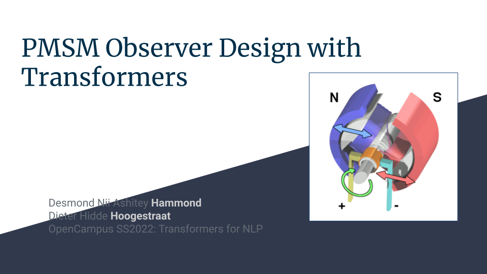

# opencampus-transformers-2022

Electrical motors play a critical role in the transition from CH-driven applications, in particular individual traffic, to more and more sustainable and climate friendly solutions for any usecase involving the conversion of energy into movement.

Permanent Magnet Synchronous Motors (PMSMs) are motor with a rotor being a permanent magnet instead of build as an energy demanding coil. They are a "state of the art" technique for electrical cars. But PMSMs are more difficult to control than conventional electrical motors.

We used a computer vision based Tensorflow Transformers model to predict a set of just the next voltage measurement from those measurement taken before. With such a predicting observer it is possible to control the torque of the PMSM.

